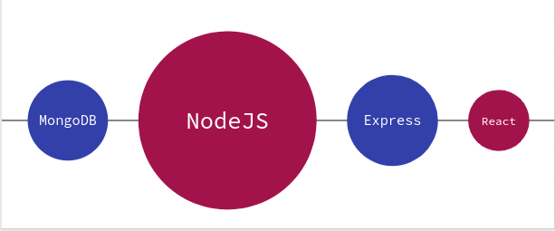
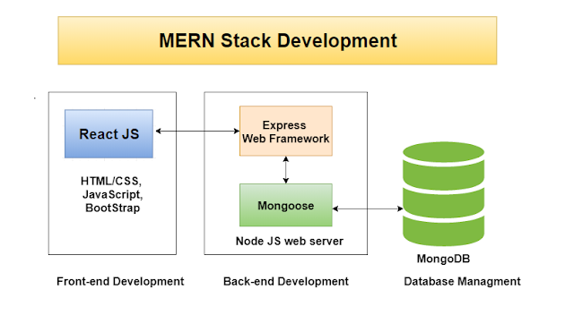

# Sommy's Store
A MERN stack e-commerce web application designed to simulate real-world online shopping experience.

## Table of content
* [Technologies used](#technologies-speech_balloon)
* [Architecture](#architecture-couple)
* [Demo](#demo-running)
* [Installation](#installation)
* [Author](#author-black_nib)
* [License](#license-pray)

### Technologies :speech_balloon:

#### Third Party Services 
* JWT
* Postman
* MongoDB Compass


### Architecture :couple:


### Demo :running:


### Installation :thumbsup:
These instructions will get you a copy of the project up and running on your local machine for development and testing purposes.

**Prerequisites**
NPM / Yarn and Node.js installed

**Installing**
Installing NPM modules on both client and server folders

Execute these commands from the project directory
```
cd client && npm install
```
```
cd server && npm install
```
**Running the app**
Open a terminal on server directory
```
npm run start:dev
```
and open another terminal on client directory
```
npm run start
```
Access the web app at http://localhost:3000/

### Author :black_nib:

* Ukonu Divine Chisom <[divine-chisom](https://github.com/divine-chisom)>

### License :pray:
Licensed under the [MIT License](LICENSE)